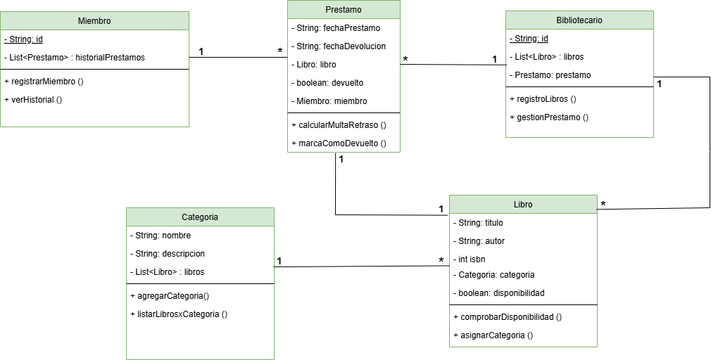

# diagramas-de-clases

# Diagramas de clases

## Ejercicio 1: Sistema de Reserva de Hoteles


### A continuación se muestran las clases del proyecto:

## Cliente

``` code
package es.ies.puerto.hotel;
/**
 * @author materancode
 * @version 1.0.0
 */

import java.util.List;
import java.util.Objects;

public class Cliente {
       private String nombre;
    private int numeroContacto;
    private String email;
    private List<Reserva> reservas;

    /**
     * Constructor por defecto.
     */
    public Cliente() {}

    /**
     * Constructor general.
     * @param nombre
     * @param numeroContacto
     * @param email
     * @param reservas
     */
    public Cliente(String nombre, int numeroContacto, String email, List<Reserva> resrvas) {
        this.nombre = nombre;
        this.numeroContacto = numeroContacto;
        this.email = email;
        this.reservas = resrvas;
    }

    public String getNombre() {
        return this.nombre;
    }

    public void setNombre(String nombre) {
        this.nombre = nombre;
    }

    public int getNumeroContacto() {
        return this.numeroContacto;
    }

    public void setNumeroContacto(int numeroContacto) {
        this.numeroContacto = numeroContacto;
    }

    public String getemail() {
        return this.email;
    }

    public void setemail(String email) {
        this.email = email;
    }

    public List<Reserva> getReservas() {
        return this.reservas;
    }

    public void setReservas(List<Reserva> resrvas) {
        this.reservas = resrvas;
    }

    /**
     * Funcíon para registrar un cliente.
     * @return
     */
    public boolean registrarCliente() {
        return false;
    }

    /**
     * Función para obtener información.
     * @return
     */
    public String obtenerInformacion() {
        return "";
    }


    @Override
    public String toString() {
        return "{" +
            " nombre='" + nombre + "'" +
            ", numeroContacto='" + numeroContacto + "'" +
            ", email='" + email + "'" +
            ", reservas='" + reservas + "'" +
            "}";
    }


    @Override
    public boolean equals(Object o) {
        if (o == this)
            return true;
        if (!(o instanceof Cliente)) {
            return false;
        }
        Cliente cliente = (Cliente) o;
        return Objects.equals(nombre, cliente.nombre) && numeroContacto == cliente.numeroContacto && Objects.equals(email, cliente.email) && Objects.equals(reservas, cliente.reservas);
    }

    @Override
    public int hashCode() {
        return Objects.hash(nombre, numeroContacto, email, reservas);
    }
    
}

```

## Habitacion

``` code
package es.ies.puerto.hotel;
/**
 * @author materancode
 * @version 1.0.0
 */

import java.util.List;
import java.util.Objects;

public class Habitacion {
        private int numHabitacion;
    private String tipoHabitacion;
    private float precioPorNoche;
    private List<Reserva> reservas;
    private boolean disponibilidad;

    /**
     * Constructor vacio.
     */
    public Habitacion() {}

    /**
     * Constructor general.
     * @param numHabitacion
     * @param tipoHabitacion
     * @param precioPorNoche
     * @param reservas
     * @param disponibilidad
     */
    public Habitacion(int numHabitacion, String tipoHabitacion, float precioPorNoche, List<Reserva> reservas, boolean disponibilidad) {
        this.numHabitacion = numHabitacion;
        this.tipoHabitacion = tipoHabitacion;
        this.precioPorNoche = precioPorNoche;
        this.reservas = reservas;
        this.disponibilidad = disponibilidad;
    }

    public int getnumHabitacion() {
        return this.numHabitacion;
    }

    public void setnumHabitacion(int numHabitacion) {
        this.numHabitacion = numHabitacion;
    }

    public String getTipoHabitacion() {
        return this.tipoHabitacion;
    }

    public void setTipoHabitacion(String tipoHabitacion) {
        this.tipoHabitacion = tipoHabitacion;
    }

    public float getprecioPorNoche() {
        return this.precioPorNoche;
    }

    public void setprecioPorNoche(float precioPorNoche) {
        this.precioPorNoche = precioPorNoche;
    }

    public List<Reserva> getReservas() {
        return this.reservas;
    }

    public void setReservas(List<Reserva> reservas) {
        this.reservas = reservas;
    }

    public boolean getDisponibilidad() {
        return this.disponibilidad;
    }

    public void setDisponibilidad(boolean disponibilidad) {
        this.disponibilidad = disponibilidad;
    }

    /**
     * Función para comprobar la disponibilidad.
     * @return
     */
    public boolean comprobarDisponobilidad() {
        return false;
    }

    /**
     * Función para cambiar el estado.
     * @return
     */
    public boolean cambiarEstado() {
        return false;
    }

    @Override
    public boolean equals(Object o) {
        if (o == this) return true;
        if (!(o instanceof Habitacion)) return false;
        Habitacion habitacion = (Habitacion) o;
        return numHabitacion == habitacion.numHabitacion && 
        Objects.equals(tipoHabitacion, habitacion.tipoHabitacion) && 
                       precioPorNoche == habitacion.precioPorNoche && 
        Objects.equals(reservas, habitacion.reservas) && 
                       disponibilidad == habitacion.disponibilidad;
    }

    @Override
    public int hashCode() {
        return Objects.hash(numHabitacion, tipoHabitacion, precioPorNoche, reservas, disponibilidad);
    }

    @Override
    public String toString() {
        return "{" +
            " numHabitacion='" + getnumHabitacion() + "'" +
            ", tipoHabitacion='" + getTipoHabitacion() + "'" +
            ", precioPorNoche='" + getprecioPorNoche() + "'" +
            ", reservas='" + getReservas() + "'" +
            ", disponibilidad='" + getDisponibilidad() + "'" +
            "}";
    }
}

```

## Reserva

``` code
package es.ies.puerto.hotel;

import java.util.Objects;

/**
 * @author materancode
 * @version 1.0.0
 */

public class Reserva {
    private String fechaEntrada;
    private String fechaSalida;
    private Cliente cliente;
    private Habitacion habitacion;
    private boolean confirmacion;

    /**
     * Constructor por defecto.
     */
    public Reserva() {}

    /**
     * Constructor general.
     * @param fechaEntrada
     * @param fechaSalida
     * @param cliente
     * @param habitacion
     * @param confirmacion
     */
    public Reserva(String fechaEntrada, String fechaSalida, Cliente cliente, Habitacion habitacion, boolean confirmacion) {
        this.fechaEntrada = fechaEntrada;
        this.fechaSalida = fechaSalida;
        this.cliente = cliente;
        this.habitacion = habitacion;
        this.confirmacion = confirmacion;
    }

    public String getFechaEntrada() {
        return this.fechaEntrada;
    }

    public void setFechaEntrada(String fechaEntrada) {
        this.fechaEntrada = fechaEntrada;
    }

    public String getFechaSalida() {
        return this.fechaSalida;
    }

    public void setFechaSalida(String fechaSalida) {
        this.fechaSalida = fechaSalida;
    }

    public Cliente getCliente() {
        return this.cliente;
    }

    public void setCliente(Cliente cliente) {
        this.cliente = cliente;
    }

    public Habitacion getHabitacion() {
        return this.habitacion;
    }

    public void setHabitacion(Habitacion habitacion) {
        this.habitacion = habitacion;
    }

    public boolean isConfirmacion() {
        return this.confirmacion;
    }

    public boolean getConfirmacion() {
        return this.confirmacion;
    }

    public void setConfirmacion(boolean confirmacion) {
        this.confirmacion = confirmacion;
    }

    /**
     * Función para calcular el costo de una reserva.
     * @return
     */
    public float calcularCostoTotal() {
        return 0.0f;
    }

    /**
     * Función para confirmar una reserva.
     * @return
     */
    public boolean confirmarReserva() {
        return false;
    }

    @Override
    public boolean equals(Object o) {
        if (o == this) return true;
        if (!(o instanceof Reserva)) return false;
        Reserva reserva = (Reserva) o;
        return Objects.equals(fechaEntrada, reserva.fechaEntrada) &&
               Objects.equals(fechaSalida, reserva.fechaSalida) &&
               Objects.equals(cliente, reserva.cliente) &&
               Objects.equals(habitacion, reserva.habitacion) &&
               Objects.equals(confirmacion, reserva.confirmacion);
    }

    @Override
    public int hashCode() {
        return Objects.hash(fechaEntrada, fechaSalida, cliente, habitacion, confirmacion);
    }

    @Override
    public String toString() {
        return "{" +
            " fechaEntrada='" + getFechaEntrada() + "'" +
            ", fechaSalida='" + getFechaSalida() + "'" +
            ", cliente='" + getCliente() + "'" +
            ", habitacion='" + getHabitacion() + "'" +
            ", confirmacion='" + isConfirmacion() + "'" +
            "}";
    }
    
}

```
## Ejercicio 2: Sistema de Gestión de Bibliotecas

## Sistema A:



### A continuación se muestran las clases del proyecto:

## Libro

``` code
package main.java.es.ies.puerto.biblioteca_a;

import java.util.Objects;

/**
 * @author materancode
 * @version1.0.0
 */

public class Libro {
        private String titulo;
    private String autor;
    private int isbn;
    private Categoria categoria;
    private boolean disponibilidad;

    /**
     * Constructor por defecto.
     */
    public Libro() {}

    /**
     * Constructor solo con el isbn.
     * @param isbn
     */
    public Libro(int isbn) {
        this.isbn = isbn;
    }    

    /**
     * Constructor general.
     * @param titulo
     * @param autor
     * @param isbn
     * @param categoria
     * @param disponibilidad
     */
    public Libro(String titulo, String autor, int isbn, Categoria categoria, boolean disponibilidad) {
        this.titulo = titulo;
        this.autor = autor;
        this.isbn = isbn;
        this.categoria = categoria;
        this.disponibilidad = disponibilidad;
    }

    public String getTitulo() {
        return this.titulo;
    }

    public void setTitulo(String titulo) {
        this.titulo = titulo;
    }

    public String getAutor() {
        return this.autor;
    }

    public void setAutor(String autor) {
        this.autor = autor;
    }

    public int getIsbn() {
        return this.isbn;
    }

    public void setIsbn(int isbn) {
        this.isbn = isbn;
    }

    public Categoria getCategoria() {
        return this.categoria;
    }

    public void setCategoria(Categoria categoria) {
        this.categoria = categoria;
    }

    public boolean isDisponibilidad() {
        return this.disponibilidad;
    }

    public boolean getDisponibilidad() {
        return this.disponibilidad;
    }

    public void setDisponibilidad(boolean disponibilidad) {
        this.disponibilidad = disponibilidad;
    }

    /**
     * Función que verifica la disponibilidad.
     * @return
     */
    public boolean comprobarDisponibilidad() {
        return false;
    }

    /**
     * Función que asigna a una categoria.
     * @return
     */
    public boolean asignarCategoria() {
        return false;
    }

    @Override
    public boolean equals(Object o) {
        if (o == this) return true;
        if (!(o instanceof Libro)) return false;
        Libro libro = (Libro) o;
        return isbn == libro.isbn;
    }

    @Override
    public int hashCode() {
        return Objects.hash(titulo, autor, isbn, categoria, disponibilidad);
    }

    @Override
    public String toString() {
        return "{" +
            " titulo='" + getTitulo() + "'" +
            ", autor='" + getAutor() + "'" +
            ", isbn='" + getIsbn() + "'" +
            ", categoria='" + getCategoria() + "'" +
            ", disponibilidad='" + isDisponibilidad() + "'" +
            "}";
    }
    
}


```

## Categoria

``` code
package main.java.es.ies.puerto.biblioteca_a;

import java.util.List;
import java.util.Objects;

/**
 * @author materancode
 * @version1.0.0
 */

public class Categoria {
     private String nombre;
    private String descripcion;
    private List<Libro> libros;

    /**
     * Constructor por defecto.
     */
    public Categoria() {
    }

    /**
     * Constructor general.
     * @param nombre
     * @param descripcion
     * @param libros
     */
    public Categoria(String nombre, String descripcion, List<Libro> libros) {
        this.nombre = nombre;
        this.descripcion = descripcion;
        this.libros = libros;
    }

    public String getNombre() {
        return this.nombre;
    }

    public void setNombre(String nombre) {
        this.nombre = nombre;
    }

    public String getDescripcion() {
        return this.descripcion;
    }

    public void setDescripcion(String descripcion) {
        this.descripcion = descripcion;
    }

    public List<Libro> getLibros() {
        return this.libros;
    }

    public void setLibros(List<Libro> libros) {
        this.libros = libros;
    }

    /**
     * Función que agrega a una categoria.
     * @return
     */
    public boolean agregarCategoria() {
        return false;
    }

    /**
     * Función que lista libros por categoria.
     * @return
     */
    public List<Libro> listarLibrosxCategoria() {
        return null;
    }

    @Override
    public boolean equals(Object o) {
        if (o == this) return true;
        if (!(o instanceof Categoria)) return false;
        Categoria categoria = (Categoria) o;
        return Objects.equals(nombre, categoria.nombre) &&
               Objects.equals(descripcion, categoria.descripcion) &&
               Objects.equals(libros, categoria.libros);
    }

    @Override
    public int hashCode() {
        return Objects.hash(nombre, descripcion, libros);
    }

    @Override
    public String toString() {
        return "{" +
            " nombre='" + getNombre() + "'" +
            ", descripcion='" + getDescripcion() + "'" +
            ", libros='" + getLibros() + "'" +
            "}";
    }
}


```

## Bibliotecario

``` code
package main.java.es.ies.puerto.biblioteca_a;

/**
 * @author materancode
 * @version1.0.0
 */

import java.util.List;
import java.util.Objects;

public class Bibliotecario {
       private String id;
    private List<Libro> libros;
    private Prestamo prestamo;

    /**
     * Constructor por defecto.
     */
    public Bibliotecario() {}

    /**
     * Constructor solo con el id.
     * @param id
     */
    public Bibliotecario(String id) {
        this.id = id;
    }

    /**
     * Constructor general.
     * @param id
     * @param libros
     * @param prestamo
     */
    public Bibliotecario(String id, List<Libro> libros, Prestamo prestamo) {
        this.id = id;
        this.libros = libros;
        this.prestamo = prestamo;
    }

    public String getId() {
        return this.id;
    }

    public void setId(String id) {
        this.id = id;
    }

    public List<Libro> getLibros() {
        return this.libros;
    }

    public void setLibros(List<Libro> libros) {
        this.libros = libros;
    }

    public Prestamo getPrestamo() {
        return this.prestamo;
    }

    public void setPrestamo(Prestamo prestamo) {
        this.prestamo = prestamo;
    }

    /**
     * Función que registra libros.
     * @return
     */
    public List<Libro> registroLibros() {
        return null;
    }

    /**
     * Función que gestiona un prestamo.
     * @return
     */
    public Prestamo gestionarPrestamo() {
        return null;
    }

    @Override
    public boolean equals(Object o) {
        if (o == this) return true;
        if (!(o instanceof Bibliotecario)) return false;
        Bibliotecario bibliotecario = (Bibliotecario) o;
        return Objects.equals(id, bibliotecario.id);
    }

    @Override
    public int hashCode() {
        return Objects.hash(id, libros, prestamo);
    }

    @Override
    public String toString() {
        return "{" +
            " id='" + getId() + "'" +
            ", libros='" + getLibros() + "'" +
            ", prestamo='" + getPrestamo() + "'" +
            "}";
    }
}


 ```

 ## Prestamo

 ``` code
package main.java.es.ies.puerto.biblioteca_a;

import java.util.Objects;

/**
 * @author materancode
 * @version1.0.0
 */

public class Prestamo {
      private Date fechaPrestamo;
    private Date fechaDevolucion;
    private Libro libro;
    private Miembro miembro;
    private boolean devuelto;

    /**
     * Constructor por defecto.
     */
    public Prestamo() {}

    /**
     * Constructor general.
     * @param fechaPrestamo
     * @param fechaDevolucion
     * @param libro
     * @param miembro
     * @param devuelto
     */
    public Prestamo(Date fechaPrestamo, Date fechaDevolucion, Libro libro, Miembro miembro, boolean devuelto) {
        this.fechaPrestamo = fechaPrestamo;
        this.fechaDevolucion = fechaDevolucion;
        this.libro = libro;
        this.miembro = miembro;
        this.devuelto = devuelto;
    }

    public Date getFechaPrestamo() {
        return this.fechaPrestamo;
    }

    public void setFechaPrestamo(Date fechaPrestamo) {
        this.fechaPrestamo = fechaPrestamo;
    }

    public Date getFechaDevolucion() {
        return this.fechaDevolucion;
    }

    public void setFechaDevolucion(Date fechaDevolucion) {
        this.fechaDevolucion = fechaDevolucion;
    }

    public Libro getLibro() {
        return this.libro;
    }

    public void setLibro(Libro libro) {
        this.libro = libro;
    }

    public Miembro getMiembro() {
        return this.miembro;
    }

    public void setMiembro(Miembro miembro) {
        this.miembro = miembro;
    }

    public boolean getDevuelto() {
        return this.devuelto;
    }

    public void setDevuelto(boolean devuelto) {
        this.devuelto = devuelto;
    }

    /**
     * Función que calcula la multa por retraso.
     * @return
     */
    public float calcularMultaRetraso() {
        return 0.0f;
    }

    /**
     * Función que marca como devuelto.
     * @return
     */
    public boolean marcaComoDevuelto() {
        return false;
    }

    @Override
    public boolean equals(Object o) {
        if (o == this) return true;
        if (!(o instanceof Prestamo)) return false;
        Prestamo prestamo = (Prestamo) o;
        return Objects.equals(fechaPrestamo, prestamo.fechaPrestamo) &&
               Objects.equals(fechaDevolucion, prestamo.fechaDevolucion) &&
               Objects.equals(libro, prestamo.libro) &&
               Objects.equals(miembro, prestamo.miembro) &&
                              devuelto == prestamo.devuelto;
    }

    @Override
    public int hashCode() {
        return Objects.hash(fechaPrestamo, fechaDevolucion, libro, miembro, devuelto);
    }

    @Override
    public String toString() {
        return "{" +
            " fechaPrestamo='" + getFechaPrestamo() + "'" +
            ", fechaDevolucion='" + getFechaDevolucion() + "'" +
            ", libro='" + getLibro() + "'" +
            ", miembro='" + getMiembro() + "'" +
            ", devuelto='" + getDevuelto() + "'" +
            "}";
    }
    
    
}

 ```

  ## Miembro

 ``` code
package main.java.es.ies.puerto.biblioteca_a;

import java.util.List;
import java.util.Objects;

/**
 * @author materancode
 * @version1.0.0
 */

public class Miembro {
        private String id;
    private List<Prestamo> historialPrestamos;

    /**
     * Constructor por defecto.
     */
    public Miembro() {}

    /**
     * Constructor solo con el id.
     * @param id
     */
    public Miembro(String id) {
        this.id = id;
    }

    /**
     * Constructor general.
     * @param id
     * @param historialPrestamos
     */
    public Miembro(String id, List<Prestamo> historialPrestamos) {
        this.id = id;
        this.historialPrestamos = historialPrestamos;
    }

    public String getId() {
        return this.id;
    }

    public void setId(String id) {
        this.id = id;
    }

    public List<Prestamo> getHistorialPrestamos() {
        return this.historialPrestamos;
    }

    public void setHistorialPrestamos(List<Prestamo> historialPrestamos) {
        this.historialPrestamos = historialPrestamos;
    }

    /**
     * Función que registra un miembro.
     * @return
     */
    public boolean registrarMiembro() {
        return false;
    }

    /**
     * Función que muestra el historial.
     * @return
     */
    public List<Prestamo> verHistorial() {
        return null;
    }

    @Override
    public boolean equals(Object o) {
        if (o == this) return true;
        if (!(o instanceof Miembro)) return false;
        Miembro miembro = (Miembro) o;
        return Objects.equals(id, miembro.id);
        }

    @Override
    public int hashCode() {
        return Objects.hash(id, historialPrestamos);
    }

    @Override
    public String toString() {
        return "{" +
            " id='" + getId() + "'" +
            ", historialPrestamos='" + getHistorialPrestamos() + "'" +
            "}";
    }
    
}

 ```

## Ejercicio 2: Sistema de Gestión de Bibliotecas

## Sistema B:


### A continuación se muestran las clases del proyecto:


## Editorial 

``` code
package main.java.es.ies.puerto.biblioteca_b;

import java.util.List;
import java.util.Objects;

/**
 * @author materancode
 * @version 1.0.0
 */

public class Editorial {
    private String nombre;
    private String direccion;
    private String contacto;

    /**
     * Constructor por defecto.
     */
    public Editorial() {
    }

    /**
     * Constructor genreal.
     * @param nombre
     * @param direccion
     * @param contacto
     */
    public Editorial(String nombre, String direccion, String contacto) {
        this.nombre = nombre;
        this.direccion = direccion;
        this.contacto = contacto;
    }

    public String getNombre() {
        return this.nombre;
    }

    public void setNombre(String nombre) {
        this.nombre = nombre;
    }

    public String getDireccion() {
        return this.direccion;
    }

    public void setDireccion(String direccion) {
        this.direccion = direccion;
    }

    public String getContacto() {
        return this.contacto;
    }

    public void setContacto(String contacto) {
        this.contacto = contacto;
    }

    /**
     * Función para registrar una editorial.
     * @return
     */
    public boolean registrarEditorial() {
        return false;
    }

    /**
     * Función que lista los libros de una editorial.
     * @return
     */
    public List<Libro> listarLibrosDeEditorial() {
        return null;
    }

    @Override
    public boolean equals(Object o) {
        if (o == this) return true;
        if (!(o instanceof Editorial)) return false;
        Editorial editorial = (Editorial) o;
        return Objects.equals(nombre, editorial.nombre) &&
               Objects.equals(direccion, editorial.direccion) &&
               Objects.equals(contacto, editorial.contacto);
    }

    @Override
    public int hashCode() {
        return Objects.hash(nombre, direccion, contacto);
    }

    @Override
    public String toString() {
        return "{" +
            " nombre='" + getNombre() + "'" +
            ", direccion='" + getDireccion() + "'" +
            ", contacto='" + getContacto() + "'" +
            "}";
    }
}

```

## Sala de Lectura

``` code
package main.java.es.ies.puerto.biblioteca_b;

import java.util.Objects;

/**
 * @author materancode
 * @version 1.0.0
 */

public class SalaLectura {
    private String nombre;
    private int capacidad;

    /**
     * Constructor por defecto.
     */
    public SalaLectura() {
    }

    /**
     * Constructor general.
     * @param nombre
     * @param capacidad
     */
    public SalaLectura(String nombre, int capacidad) {
        this.nombre = nombre;
        this.capacidad = capacidad;
    }

    public String getNombre() {
        return this.nombre;
    }

    public void setNombre(String nombre) {
        this.nombre = nombre;
    }

    public int getCapacidad() {
        return this.capacidad;
    }

    public void setCapacidad(int capacidad) {
        this.capacidad = capacidad;
    }

    /**
     * Función que reserva una sala.
     * @return
     */
    public boolean reservarSala() {
        return false;
    }

    /**
     * Función que verifica la disponibilidad.
     * @return
     */
    public boolean verificarDisponibilidad() {
        return false;
    }

    @Override
    public boolean equals(Object o) {
        if (o == this) return true;
        if (!(o instanceof SalaLectura)) return false;
        SalaLectura salaLectura = (SalaLectura) o;
        return Objects.equals(nombre, salaLectura.nombre) &&
                              capacidad == salaLectura.capacidad;
    }

    @Override
    public int hashCode() {
        return Objects.hash(nombre, capacidad);
    }

    @Override
    public String toString() {
        return "{" +
            " nombre='" + getNombre() + "'" +
            ", capacidad='" + getCapacidad() + "'" +
            "}";
    }
}

```